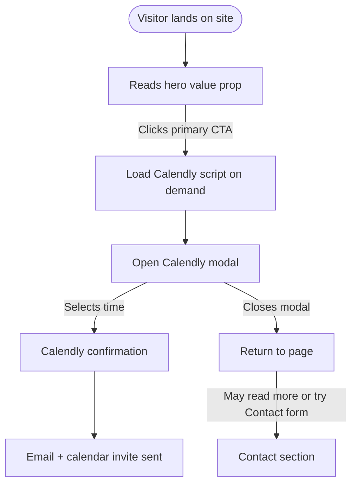
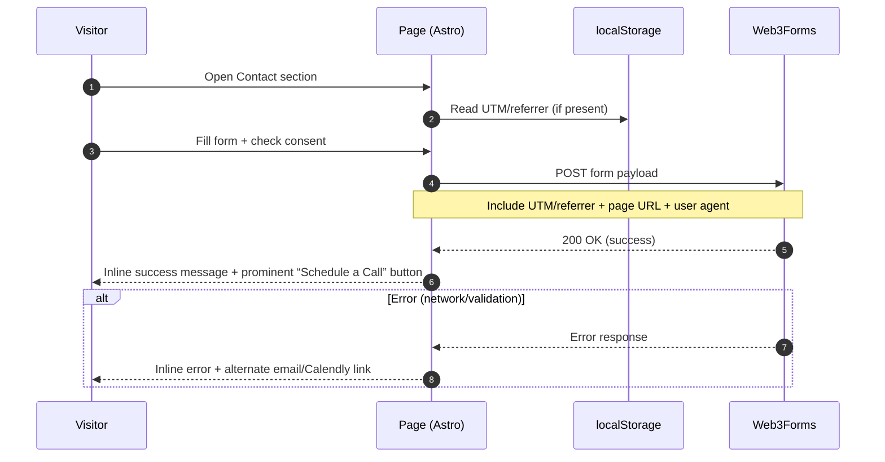
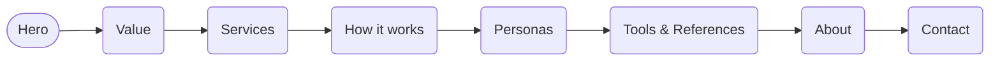
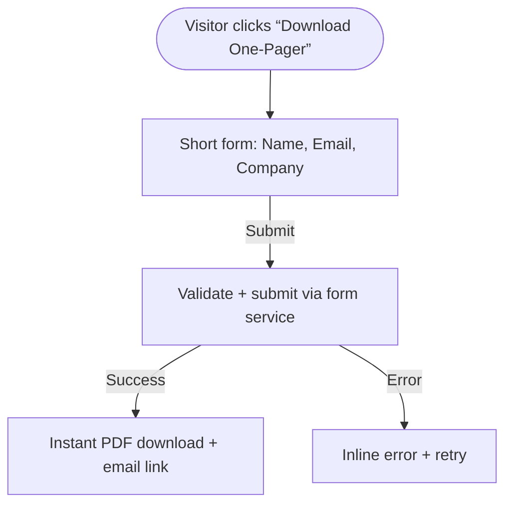

# User Flows — Spec‑Driven Consulting Website

Scope: Single‑page static marketing site hosted on Cloudflare Pages with primary CTA to schedule a call (Calendly modal) and secondary contact via a Web3Forms lead form. Future additions include a blog and a gated one‑pager download.

## Roles and Primary Intents
- Visitor (default persona)
- Product leadership (primary target): seeks business value alignment and outcomes
- Secondary personas: Engineering leadership, Testers, Developers, UX

Primary goals
- Book a call via Calendly (modal)
- Submit a contact inquiry via form (backup preference)

Secondary goals
- Learn how spec‑driven development drives outcomes
- Review services, tools, references, and about
- In the future: download one‑pager; read blog posts

## Entry Points
- Direct type‑in or link: https://specdriven.app
- Organic/social/referrals with UTM parameters
- Future: blog posts, shared one‑pager links

## Global UX Behaviors
- Sticky header with “Schedule a Call” CTA that opens Calendly modal
- Section anchors in navigation: Hero, Value, Services, How It Works, Personas, Tools/References, About, Contact
- Performance first: defer third‑party scripts; load Calendly only on click
- Attribution capture: UTM/referrer stored in localStorage (90 days) and included in form payload

## Core Flow A — Schedule a Call (Calendly Modal)


Key notes
- Modal approach prioritizes conversion and keeps the user on the page
- Fallback link opens Calendly in a new tab if modal fails

## Core Flow B — Contact Form (Web3Forms)
Fields: Name, Email, Company, Role, Phone (optional), Message. Requirements: consent checkbox; honeypot enabled.



Payload includes
- Form fields + consent
- UTM params: utm_source, utm_medium, utm_campaign, utm_term, utm_content
- Referrer, landing page URL, first touch timestamp, user agent
- Honeypot field (must be empty)

## Core Flow C — Read More via Section Anchors


## Future Flow D — Gated One‑Pager Download


## Future Flow E — Blog
```mermaid
flowchart TD
  E0([Visitor lands on Home]) --> E1[Clicks Blog]
  E1 --> E2[Blog listing (Astro Content Collections)]
  E2 --> E3[Read post]
  E3 --> E4[CTA: Schedule a Call / Contact]
```

## Error and Edge Cases
- Calendly script blocked: show fallback button to open Calendly in a new tab
- Form blocked or service error: show error state and provide direct mailto and Calendly links
- Honeypot triggered: silently drop request; show generic success
- Consent unchecked: client‑side validation prevents submit
- No UTM data: proceed without attribution fields

## Mobile Considerations
- Sticky CTA adapts to small screens without obstructing content
- Calendly modal must be scroll‑ and keyboard‑accessible; focus trapped within modal
- Form layout single‑column with large tap targets; phone optional field uses tel input

## Analytics and Measurement
- Cloudflare Web Analytics: page views, outbound link clicks (Calendly, mailto), form submit event
- Micro‑goals: CTA clicks, modal opens, successful bookings (if possible via Calendly redirect or event), form submissions

## Success Criteria
- Visitor can book a call in ≤ 3 clicks from landing
- Contact form submit + success message works reliably; follow‑up CTA to book
- Core content discoverable via anchors; no layout shifts or blocking resources
